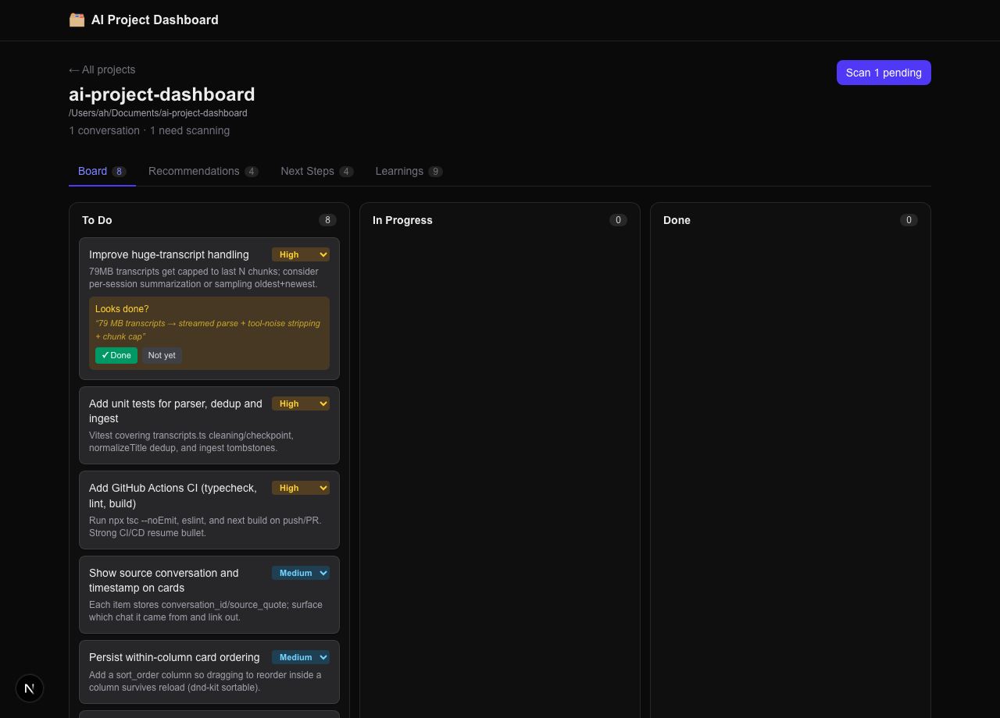

# AI Project Dashboard

[](https://github.com/Ali0600/ai-project-dashboard/actions/workflows/ci.yml)

Turn your Claude Code conversations into a visual project workspace. The dashboard scans
your local conversation transcripts and surfaces, per project, a **Kanban task board** plus
**Suggestions**, **Learnings**, and **Research** (web-sourced feature ideas) — so the ideas
and to‑dos that normally scroll away in chat don't get lost.

- **Extraction is done by Claude itself** — no separate API key. A live `/sync-board` slash
  command uses your current session; backfill and the dashboard's "Scan" button use headless
  Claude Code (`claude -p`), reusing your existing login.
- **Opt-in capture** — a folder becomes a project when you run `/sync-board` in it (or
  `npm run backfill`). After that, a `SessionEnd` hook plus live transcript-mtime detection flag new
  activity in **already-tracked** projects as "needs scan" — so random one-off sessions (e.g. in
  `/tmp`) never auto-create projects. The overview lists projects with captured items and tucks
  empty/awaiting-scan folders into a collapsible group.
- **Completion tracking** — re-scans flag tasks that look finished ("Looks done?") for you to
  confirm (fuzzy-matched, so reworded mentions still count); a **Full rescan** re-checks completions
  across all past content. You can also drag cards across the board.
- **Act on tasks** — set Urgent/High/Medium/Low priority, add tasks manually, open a detail view,
  **Promote** a suggestion onto the board, **Dismiss** items (restorable from a Dismissed section),
  copy a task or plan to the clipboard, and hit **Implement** to draft a read-only plan by resuming
  the task's source chat. Scans stream **live step-by-step progress**.



## Highlights

- Built an **event-driven capture pipeline** using Claude Code **hooks** to flag conversation
  transcripts for ingestion automatically on session end.
- Integrated a **headless LLM extraction stage** (`claude -p`, no API key) that turns raw JSONL
  transcripts into **zod-validated structured data**, with retry/repair for malformed model JSON.
- Designed a **full-stack TypeScript** app — **Next.js (App Router) + SQLite (better-sqlite3, WAL)**
  — with an interactive **drag-and-drop Kanban** board (`dnd-kit`).
- Implemented **incremental scanning** (per-conversation UUID checkpoints) and **idempotent
  de-duplication / tombstoning** via a `UNIQUE(project, kind, norm_key)` constraint.
- Authored an **idempotent installer** that safely merges a hook into `~/.claude/settings.json`,
  installs a slash command, and updates `CLAUDE.md` — preserving existing config.
- **Containerized** with a multi-stage Dockerfile (Next.js standalone output) and a persisted
  SQLite volume.
- **AI-triaged priorities** — tasks are auto-assigned Urgent/High/Medium/Low and the board sorts
  highest-first; shipped behind a guarded, idempotent SQLite column migration over a live DB.
- **Agentic "Implement"** — drafts an implementation plan by resuming a task's *source* conversation
  (`claude -p --resume`) read-only (edit/shell tools disabled), so the plan has full context.
- **"Apply on a branch"** — runs the agent with edits enabled but **sandboxed**: an isolated
  `git worktree` + `dashboard/apply-*` branch, `acceptEdits` with shell/network disabled, the diff
  captured and committed for review. The main checkout is never touched and nothing is pushed.
- **"Use Internet for Research"** — a headless `claude -p` with **WebSearch/WebFetch enabled**
  (edit/shell disabled) mines Reddit, forums, and the wider web for features people are *requesting*
  for projects like yours, then ingests them as deduped, source-linked ideas in a **Research** tab.
- **Dependency-health badges** — integrates an external [Preflight](https://preflight-web.vercel.app)
  scanner *as a service* (keyless `POST /api/scan`): reads each project's local manifest, caches the
  `Report` in SQLite (24h TTL), and surfaces it via a **"Scan deps"** panel on the project page
  (CVE/malware counts + flagged findings) — Preflight stays the single source, so its improvements
  appear with zero dashboard changes.
- **Tested & CI-gated** — Vitest unit tests for the streaming transcript parser; GitHub Actions runs
  typecheck · lint · test · build on every push.

## How it works

```
Conversation ends ──SessionEnd hook──> scripts/flag-hook.ts  ──> mark conversation needs_scan
                                          (only if cwd is already      (cheap, no LLM)
                                           a tracked project)
Extraction (any of):
  /sync-board (live session)        ─┐
  "Scan" button  -> API route       ─┼─> Claude reads transcript text ─> structured JSON
  npm run backfill (claude -p)      ─┘     (given existing open items for dedup + completion)
                                                     │
                                          lib/ingest.ts (dedup, tombstones, completion)
                                                     │
                                              SQLite (better-sqlite3)
                                                     │
                                   Next.js UI: Projects ▸ Project ▸ Kanban + tabs
```

Data source: Claude Code stores each conversation as append-only JSONL at
`~/.claude/projects/<encoded-cwd>/<session-id>.jsonl`. The parser strips tool noise and keeps
the user/assistant text.

**Plan-file backlog capture.** When a conversation references a plan-mode document
(`~/.claude/plans/<slug>.md`), the scan also folds that plan's **Backlog** section into extraction
(those edits are made via tools the transcript parser strips, so they're otherwise invisible). To
avoid noise from the design/“done” parts of a plan, only a clearly delimited backlog is read — wrap
it in `<!-- backlog:start -->` … `<!-- backlog:end -->`, or use a `## Backlog` heading (also
matched: “Not built”, “Open items”, “Remaining”, “TODO”). A plan without one contributes nothing.
Disable with `SCAN_PLAN_FILES=0`.

## Getting started

```bash
npm install
npm run backfill              # scan existing conversations (uses claude -p)
#   npm run backfill -- --project <name>   # limit to matching transcripts
#   npm run backfill -- --full             # ignore checkpoints, re-scan everything
npm run dev                   # http://localhost:3000
```

### Enable automatic capture + the /sync-board command

```bash
npm run install-hooks           # merges into ~/.claude (use --dry-run to preview)
#   npm run install-hooks -- --dry-run
```

This adds a `SessionEnd` hook, installs the `/sync-board` slash command, and appends a nudge
block to your global `CLAUDE.md`. Re-running it is safe (idempotent).

## Scripts

| Script | Purpose |
| --- | --- |
| `npm run dev` / `build` / `start` | Next.js dev / production build / serve |
| `npm test` | Run the Vitest suite (transcript parser tests) |
| `npm run backfill` | Scan existing transcripts via headless Claude |
| `npm run prioritize` | AI-assign priority (Urgent/High/Medium/Low) to existing tasks |
| `npm run ingest` | Ingest an extraction JSON (used by `/sync-board`) |
| `npm run flag-hook` | Hook target: mark a conversation `needs_scan` |
| `npm run install-hooks` | Idempotent installer for hook + command + CLAUDE.md |

## Configuration (env)

| Variable | Default | Meaning |
| --- | --- | --- |
| `DASHBOARD_DB` | `./data/dashboard.db` | SQLite file location |
| `CLAUDE_EXTRACT_MODEL` | `haiku` | Model alias for headless extraction |
| `CLAUDE_MAX_BUDGET_USD` | `0.25` | Per-call spend cap for extraction `claude -p` |
| `CLAUDE_IMPLEMENT_MODEL` | `sonnet` | Model for the "Implement" plan run |
| `CLAUDE_IMPLEMENT_BUDGET_USD` | `0.50` | Per-call spend cap for "Implement" |
| `CLAUDE_APPLY_BUDGET_USD` | `1.00` | Per-call spend cap for "Apply on a branch" (edits enabled) |
| `CLAUDE_RESEARCH_MODEL` | `sonnet` | Model for "Use Internet for Research" (web search + synthesis) |
| `CLAUDE_RESEARCH_BUDGET_USD` | `0.50` | Per-call spend cap for web research |
| `CHUNK_CHARS` | `120000` | Max characters per extraction chunk |
| `SCAN_MAX_CHUNKS` | `16` | Max chunks per conversation scan (bounds cost) |
| `SCAN_PLAN_FILES` | `1` | Set `0` to skip folding plan-file backlogs into scans |
| `DASHBOARD_FORCE_SUBSCRIPTION_AUTH` | `0` | Set `1` to strip inherited `ANTHROPIC_*` from spawned `claude` runs, forcing your persistent login (avoids 401s from an expired inherited token) |
| `PREFLIGHT_URL` | _(unset)_ | Base URL of a [Preflight](https://preflight-web.vercel.app) dependency-scanner (keyless `POST /api/scan`). When set, project cards show a CVE/malware badge. e.g. `https://preflight-web.vercel.app` or `http://localhost:3000` |

## Docker

```bash
docker build -t ai-project-dashboard .
docker run -p 3000:3000 -v "$PWD/data:/app/data" ai-project-dashboard
```

> The container serves the UI and manual board use. Automatic capture (hooks) and headless
> scanning need the host's `claude` CLI and `~/.claude` data, so run `backfill`/hooks on the host.

## Tech stack

Next.js 16 (App Router) · React 19 · TypeScript · Tailwind CSS v4 · SQLite (better-sqlite3) ·
dnd-kit · zod · Vitest · GitHub Actions CI · Claude Code (headless `claude -p`).
