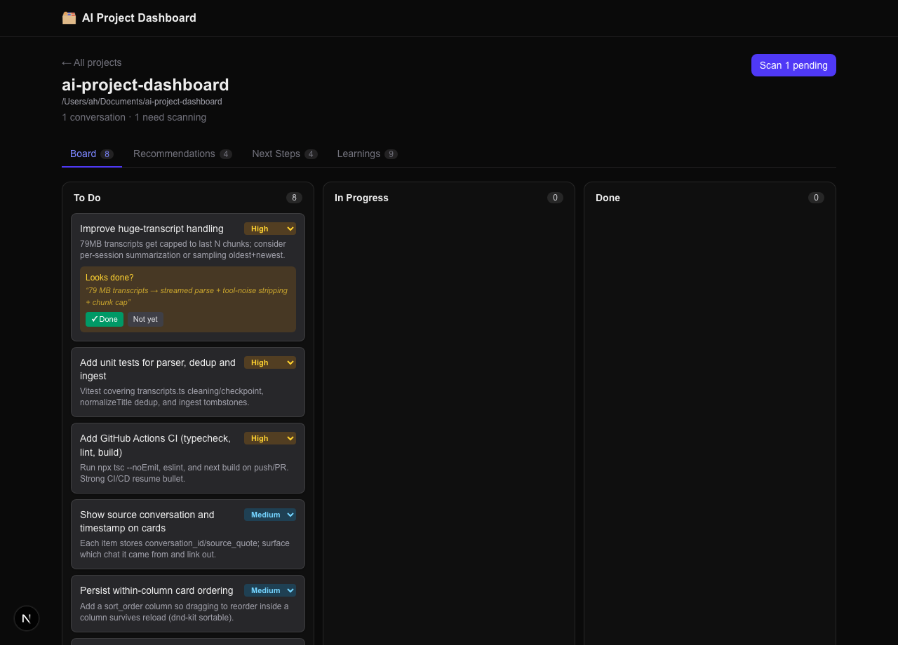

# AI Project Dashboard

[](https://github.com/Ali0600/ai-project-dashboard/actions/workflows/ci.yml)

Turn your Claude Code conversations into a visual project workspace. The dashboard scans
your local conversation transcripts. For each project it shows a **Kanban task board** plus
**Suggestions**, **Research** (feature ideas found on the web) and **Failures**. So the ideas,
to‑dos and broken things that normally scroll away in chat no longer get lost.

- **Extraction is done by Claude itself** — no separate API key. A live `/sync-board` slash
  command uses your current session. Backfill and the dashboard's "Scan" button use headless
  Claude Code (`claude -p`), which reuses your existing login.
- **Opt-in capture** — a folder becomes a project when you run `/sync-board` in it (or
  `npm run backfill`). After that, a `SessionEnd` hook plus live transcript-mtime detection flag
  new activity in **already-tracked** projects as "needs scan". So random one-off sessions (for
  example in `/tmp`) never auto-create projects. The overview lists projects with captured
  items. It tucks empty or awaiting-scan folders into a collapsible group.
- **Completion tracking** — re-scans flag tasks that look finished ("Looks done?") for you to
  confirm. Matching is fuzzy, so reworded mentions still count. A **Full rescan** re-checks
  completions across all past content. You can also drag cards across the board.
- **Act on tasks** — set Urgent/High/Medium/Low priority, add tasks by hand, open a detail view,
  **Promote** a suggestion onto the board, **Dismiss** items (restore them from a Dismissed
  section), copy a task or plan to the clipboard, and hit **Implement** to draft a read-only
  plan by resuming the task's source chat. Scans stream **live step-by-step progress**.
- **Failures tab** — things that broke and *stayed* broken (rate limits, failed builds, bad API
  responses) are captured as their own kind. They are not lost in the chat scrollback. Each one
  counts how many scans it has recurred in (`seen 3×`) and sorts by that count, because the
  thing that keeps happening is the thing worth fixing. **"How do I fix this?"** runs a
  web-search agent on that specific error. It stores a sourced fix writeup: what the error
  means, the likely cause, the fix, how to verify it, and a lasting mitigation. Each claim links
  to its source. **Create fix task** puts the work on the board while the failure stays put, so
  a recurrence during the fix still counts. Recurring failures also show up in the overview's
  "Needs you" list.



## Highlights

- Built an **event-driven capture pipeline** on Claude Code **hooks**. It flags conversation
  transcripts for ingestion automatically when a session ends.
- Added a **headless LLM extraction stage** (`claude -p`, no API key). It turns raw JSONL
  transcripts into **zod-validated structured data**, with retry and repair for malformed model
  JSON.
- Designed a **full-stack TypeScript** app — **Next.js (App Router) + SQLite (better-sqlite3, WAL)**
  — with an interactive **drag-and-drop Kanban** board (`dnd-kit`).
- Implemented **incremental scanning** (per-conversation UUID checkpoints) and **idempotent
  de-duplication / tombstoning** (idempotent: safe to run twice) through a
  `UNIQUE(project, kind, norm_key)` constraint.
- Wrote an **idempotent installer** that safely merges a hook into `~/.claude/settings.json`,
  installs a slash command, and updates `CLAUDE.md` — while keeping your existing config.
- **Containerized** it with a multi-stage Dockerfile (Next.js standalone output) and a persisted
  SQLite volume.
- **AI-triaged priorities** — tasks get Urgent/High/Medium/Low automatically, and the board sorts
  highest-first. This shipped behind a guarded, idempotent SQLite column migration over a live DB.
- **Agentic "Implement"** — drafts an implementation plan by resuming a task's *source*
  conversation (`claude -p --resume`) read-only (edit and shell tools disabled), so the plan has
  full context.
- **"Apply on a branch"** — runs the agent with edits enabled but **sandboxed**: an isolated
  `git worktree` (a second checkout of the repo) plus a `dashboard/apply-*` branch, `acceptEdits`
  with shell and network disabled. The diff is captured and committed for review. The main
  checkout is never touched and nothing is pushed.
- **"Use Internet for Research"** — a headless `claude -p` with **WebSearch/WebFetch enabled**
  (edit and shell disabled) mines Reddit, forums, and the wider web for features people are
  *asking for* in projects like yours. It then ingests them as deduped, source-linked ideas in a
  **Research** tab.
- **Dependency-health badges** — uses an external [Preflight](https://preflight-web.vercel.app)
  scanner *as a service* (keyless `POST /api/scan`). It reads each project's local manifest,
  caches the `Report` in SQLite (24h TTL), and shows it in a **"Scan deps"** panel on the project
  page (CVE/malware counts plus flagged findings). Preflight stays the single source, so its
  improvements appear with zero dashboard changes.
- **Tested & CI-gated** — Vitest unit tests cover the streaming transcript parser, store,
  database, plan-file and Claude layers. GitHub Actions runs typecheck · lint · test · build on
  every push.

## How it works

```
Conversation ends ──SessionEnd hook──> scripts/flag-hook.ts  ──> mark conversation needs_scan
                                          (only if cwd is already      (cheap, no LLM)
                                           a tracked project)
Extraction (any of):
  /sync-board (live session)        ─┐
  "Scan" button  -> API route       ─┼─> Claude reads transcript text ─> structured JSON
  npm run backfill (claude -p)      ─┘     (given existing open items for dedup + completion)
                                                     │
                                          lib/ingest.ts (dedup, tombstones, completion)
                                                     │
                                              SQLite (better-sqlite3)
                                                     │
                                   Next.js UI: Projects ▸ Project ▸ Kanban + tabs
```

Data source: Claude Code stores each conversation as append-only JSONL at
`~/.claude/projects/<encoded-cwd>/<session-id>.jsonl`. The parser strips tool noise and keeps
the user/assistant text.

**Plan-file backlog capture.** A conversation may reference a plan-mode document
(`~/.claude/plans/<slug>.md`). When it does, the scan also folds that plan's **Backlog** section
into extraction. Those edits happen through tools the transcript parser strips, so they are
otherwise invisible. To avoid noise from the design or “done” parts of a plan, only a clearly
marked backlog is read. Wrap it in `<!-- backlog:start -->` … `<!-- backlog:end -->`, or use a
`## Backlog` heading (also matched: “Not built”, “Open items”, “Remaining”, “TODO”). A plan
without one contributes nothing. Disable this with `SCAN_PLAN_FILES=0`.

## Getting started

```bash
npm install
npm run backfill              # scan existing conversations (uses claude -p)
#   npm run backfill -- --project <name>   # limit to matching transcripts
#   npm run backfill -- --full             # ignore checkpoints, re-scan everything
npm run dev                   # http://localhost:3000
```

### Enable automatic capture + the /sync-board command

```bash
npm run install-hooks           # merges into ~/.claude (use --dry-run to preview)
#   npm run install-hooks -- --dry-run
```

This adds a `SessionEnd` hook, installs the `/sync-board` slash command, and appends a nudge
block to your global `CLAUDE.md`. It is safe to run again (idempotent).

## Scripts

| Script | Purpose |
| --- | --- |
| `npm run dev` / `build` / `start` | Next.js dev / production build / serve |
| `npm test` | Run the Vitest suite (transcript parser tests) |
| `npm run backfill` | Scan existing transcripts via headless Claude |
| `npm run prioritize` | AI-assign priority (Urgent/High/Medium/Low) to existing tasks |
| `npm run ingest` | Ingest an extraction JSON (used by `/sync-board`) |
| `npm run flag-hook` | Hook target: mark a conversation `needs_scan` |
| `npm run install-hooks` | Idempotent installer for hook + command + CLAUDE.md |

## Configuration (env)

| Variable | Default | Meaning |
| --- | --- | --- |
| `DASHBOARD_DB` | `./data/dashboard.db` | SQLite file location |
| `CLAUDE_EXTRACT_MODEL` | `haiku` | Model alias for headless extraction |
| `CLAUDE_MAX_BUDGET_USD` | `0.25` | Per-call spend cap for extraction `claude -p` |
| `CLAUDE_IMPLEMENT_MODEL` | `sonnet` | Model for the "Implement" plan run |
| `CLAUDE_IMPLEMENT_BUDGET_USD` | `0.50` | Per-call spend cap for "Implement" |
| `CLAUDE_APPLY_BUDGET_USD` | `1.00` | Per-call spend cap for "Apply on a branch" (edits enabled) |
| `CLAUDE_RESEARCH_MODEL` | `sonnet` | Model for "Use Internet for Research" (web search + synthesis) |
| `CLAUDE_RESEARCH_BUDGET_USD` | `0.50` | Per-call spend cap for web research |
| `CLAUDE_FIX_RESEARCH_MODEL` | `sonnet` | Model for "How do I fix this?" on a captured failure |
| `CLAUDE_FIX_RESEARCH_BUDGET_USD` | `0.50` | Per-call spend cap for fix research |
| `CHUNK_CHARS` | `120000` | Max characters per extraction chunk |
| `SCAN_MAX_CHUNKS` | `16` | Max chunks per conversation scan (bounds cost) |
| `SCAN_PLAN_FILES` | `1` | Set `0` to skip folding plan-file backlogs into scans |
| `DASHBOARD_FORCE_SUBSCRIPTION_AUTH` | `0` | Set `1` to strip inherited `ANTHROPIC_*` from spawned `claude` runs, forcing your persistent login (avoids 401s from an expired inherited token) |
| `DASHBOARD_AUTO_SCAN` | `0` | Set `1` to extract automatically when a session ends, instead of waiting for you to click **Scan**. Recommended: transcripts are pruned on Claude Code's own schedule, so unscanned sessions can expire before they're ever captured. Runs detached (never blocks Claude Code), takes a per-session lock so it can't double-extract, and logs every run to `data/auto-scan.log` |
| `PREFLIGHT_URL` | _(unset)_ | Base URL of a [Preflight](https://preflight-web.vercel.app) dependency-scanner (keyless `POST /api/scan`). When set, project cards show a CVE/malware badge. e.g. `https://preflight-web.vercel.app` or `http://localhost:3000` |

## Docker

```bash
docker build -t ai-project-dashboard .
docker run -p 127.0.0.1:3000:3000 -v "$PWD/data:/app/data" ai-project-dashboard
```

> The published port is bound to `127.0.0.1` on purpose. This dashboard has no authentication.
> Its API can delete projects and start edit-enabled Claude runs against your local repos. So it
> must never be reachable from the network. `npm run dev` / `npm start` bind `127.0.0.1` for the
> same reason (Next's own default is `0.0.0.0`).

> The container serves the UI and manual board use. Automatic capture (hooks) and headless
> scanning need the host's `claude` CLI and `~/.claude` data. So run `backfill` and hooks on the
> host.

## Tech stack

Next.js 16 (App Router) · React 19 · TypeScript · Tailwind CSS v4 · SQLite (better-sqlite3) ·
dnd-kit · zod · Vitest · GitHub Actions CI · Claude Code (headless `claude -p`).

## Experience Gained

- Built a capture pipeline on Claude Code hooks: a `SessionEnd` hook flags transcripts at 0 LLM
  cost; a headless `claude -p` stage (no API key) turns JSONL into zod-checked data with repair.
- Designed a full-stack TypeScript app on Next.js 16, React 19 and better-sqlite3 (WAL) with a
  drag-and-drop Kanban, scan checkpoints and `UNIQUE(project, kind, norm_key)` dedup/tombstoning.
- Shipped guarded, idempotent SQLite column migrations over a live database, including AI-triaged
  task priorities on 4 levels (Urgent/High/Medium/Low) that sort the board highest-first.
- Sandboxed 2 agentic paths: "Implement" reopens a task's source chat with edit and shell tools
  off; "Apply on a branch" edits in an isolated `git worktree`, no shell or network, not pushed.
- Integrated a keyless dependency scanner with a 24-hour SQLite-cached report per project, and a
  web-research stage that mines requested features and writes sourced fixes for repeat failures.
- Containerized with a multi-stage Dockerfile (Next.js standalone output) and a persisted SQLite
  volume, binding the unauthenticated UI to `127.0.0.1` in both the container and the dev server.
- Wrote an idempotent installer for a hook in `~/.claude/settings.json`, a slash command and a
  `CLAUDE.md` block, keeping existing config; 62 Vitest cases and CI gate every push.
